# Hacking process

[](https://www.pixmoving.com)

## CAN tutorial
### The CAN Bus
CAN is a simple protocol used in manufacturing and in the automobile industry. Modern vehicles are full of little embedded systems and electronic control units (ECUs) that can communicate using the CAN protocol.

CAN runs on two wires: CAN high (CANH) and CAN low (CANL). CAN uses differential signaling, which means that when a signal comes in, CAN raises the voltage on one line and drops the other line an equal amount. Differential signaling is used in environments that must be fault tolerant to noise, such as in automotive systems and manufacturing.

The two twisted-pair wires make up the bus and require the bus to be terminated on each end. There’s a 120-ohm resistor across both wires on the termination ends. If the module isn’t on the end of the bus, it doesn’t have to worry about termination. As someone who may tap into the lines, the only time you’ll need to worry about termination is if you remove a terminating device in order to sniff the wires.

### CAN Bus Packet Layout
There are two types of CAN packets: standard and extended. Extended packets are like standard ones but with a larger space to hold IDs.

### Standard Packets
Each CAN bus packet contains four key elements:

**Arbitration ID** The arbitration ID is a broadcast message that identifies the ID of the device trying to communicate, though any one device can send multiple arbitration IDs. If two CAN packets are sent along the bus at the same time, the one with the lower arbitration ID wins.

**Identifier extension (IDE)** This bit is always 0 for standard CAN.

**Data length code (DLC)** This is the size of the data, which ranges from 0 to 8 bytes.

**Data** This is the data itself. The maximum size of the data carried by a standard CAN bus packet can be up to 8 bytes.

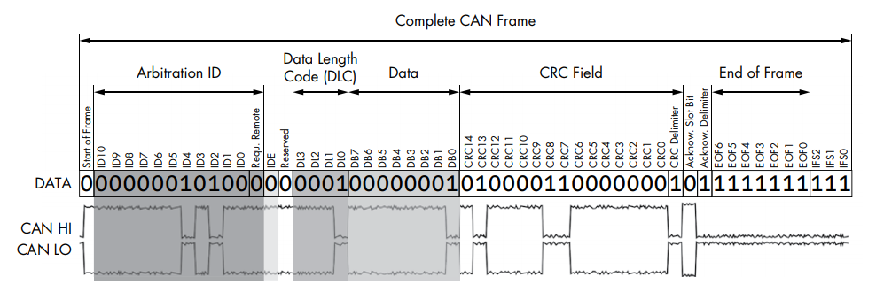

Because CAN bus packets are broadcast, all controllers on the same network see every packet, kind of like UDP on Ethernet networks. The packets don’t carry information about which controller (or attacker) sent what. Because any device can see and transmit packets, it’s trivial for any device on the bus to simulate any other device.

### Extended Packets

Extended packets are like standard ones, except that they can be chained together to create longer IDs. Extended packets are designed to fit inside standard CAN formatting in order to maintain backward compatibility. So if a sensor/ECU doesn’t have support for extended packets, it won’t break if another packet transmits extended CAN packets on the same network.

### ISO-TP Protocol

ISO 15765-2, also known as ISO-TP, is a standard for sending packets over the CAN bus that extends the 8-byte CAN limit to support up to 4095 bytes by chaining CAN packets together. The most common use of ISO-TP is for diagnostics (Unified Diagnostic Services or UDS) but it can also be used any time large amounts of data need to be transferred over CAN.

### CANopen Protocol

Another example of extending the CAN protocol is the CANopen protocol. CANopen breaks down the 11-bit identifier to a 4-bit function code and 7-bit node ID—a combination known as a communication object identifier (COB-ID). A broadcast message on this system has 0x for both the function code and the node ID. CANopen is seen more in industrial settings than it is in automotive ones.
If you see a bunch of arbitration IDs of 0x0, you’ve found a good indicator that the system is using CANopen for communications. CANopen is very similar to normal CAN but has a defined structure around the arbitration IDs. For example, heartbeat messages are in the format of 0x700 + node ID. Of course CANopen and normal CAN can cohabitate on the same network.

## Sniffing CAN

### Using SocketCAN in Linux

When you begin using a CAN for vehicle communications, you may well find it to be a lot of different drivers and software utilities. The ideal would be to unify the CAN tools and their different interfaces into a common interface so we could easily share information between tools. Luckily, there’s a set of tools with a common interface, and it’s free! If you have Linux you already have this interface called SocketCan.

The term SocketCAN is used to refer to the implementation of CAN drivers as network devices, like Ethernet cards, and to describe application access to the CAN bus via the network socket–programming interface.

The `can-utils package` provides several applications and tools to interact with the CAN network devices. 

Install it using : 
```sh
sudo apt-get install can-utils
```

Now is also a good time to install your SocketCan compatible CAN interface driver. Follow the manufacturer's instructions. 

For example, when you plug in a PEAK-System PCAN-USB adapter, and you use the display message command `dmesg`, you should see output similar to this:

```sh
$ dmesg
[ 8603.743057] CAN device driver interface
[ 8603.748745] peak_usb 3-2:1.0: PEAK-System PCAN-USB adapter hwrev 28 serial
 FFFFFFFF (1 channel)
[ 8603.749554] peak_usb 3-2:1.0 can0: attached to PCAN-USB channel 0 (device
 255)
[ 8603.749664] usbcore: registered new interface driver peak_usb
```

You can verify the interface loaded properly with ifconfig and ensure a can0 interface is now present:


```sh
$ ifconfig can0
can0 	Link encap:UNSPEC HWaddr 00-00-00-00-00-00-00-00-00-00-00-00-00-00-00-00
		UP RUNNING NOARP MTU:16 Metric:1
		RX packets:0 errors:0 dropped:0 overruns:0 frame:0
		TX packets:0 errors:0 dropped:0 overruns:0 carrier:0
		collisions:0 txqueuelen:10
		RX bytes:0 (0.0 B) TX bytes:0 (0.0 B) 
```

Now set the Can BUS speed. The key component you need to set is the bit rate. This is the speed of the bus. A typical value for CAN is 500Kbps. Values of 250Kbps or 125Kbps are typical for lower-speed CAN buses. 


```sh
sudo ip link set can0 type can bitrate 500000
sudo ip link set up can0
```

#### Can Utils package
With our CAN device up and running, let’s take a high-level look at the `can-utils`. They’re listed and described briefly here; 

**candump**: This utility dumps CAN packets on the screen. Used to see raw traffic on the CAN bus.

```sh
candump can0
```

**cansend**: Send a single CAN message on the bus. Pass the CAN ID, then # then the data bytes.

```sh
cansend can0 120#0011223344
```

**cansniffer**: See changing CAN traffic. Very useful to identify which bytes of which message contain the value for a sensor like the accelerator, brake, steering wheel sensor.

```sh
cansniffer can0 -cae
```

**canplayer**: Replay captured CAN log file from `candump`.

```sh
canplayer -I can_trace.asc can0
```

#### Using a GUI CAN diagnostic tool in Linux

[Kayak](http://kayak.2codeornot2code.org/), is a Java-based GUI for CAN diagnostics and monitoring and therefore can run on Linux.
Kayak is based on SocketCAN and the connection to a SocketCAN bus takes place using TCP/IP and a [socketcand](https://github.com/dschanoeh/socketcand) server. Therefore the bus access is network transparent and can be shared with multiple users.
Kayak uses the [open CAN definition format kcd](https://github.com/julietkilo/kcd). Existing [.dbc CAN definitions](http://socialledge.com/sjsu/index.php/DBC_Format) can be converted to kcd using [CANBabel](https://github.com/julietkilo/CANBabel).

### Using BUSMASTER in Windows 
[BUSMASTER](https://rbei-etas.github.io/busmaster/) is an open source PC software for the design, monitoring, analysis, and simulation of CAN networks. In functionnality, it is almost comparable to a top of the line software like [CANalyzer](https://vector.com/vi_canalyzer_en.html) from Vector Informatik GmbH.

#### Features

* Supports all of the main CAN Bus Interface USB Modules
* Creation and editing of CAN databases (*.dbf)
* Message filtering by hardware or software
* Logging and replay of CAN messages
* Creation of programmable nodes by use of an ANSI C function editor
* Import converters for DBC database files and CAPL programs

#### Software requirements
[BUSMASTER](https://rbei-etas.github.io/busmaster/)

[TDM-GCC MinGW Compiler 32bits](http://sourceforge.net/projects/tdm-gcc/files/TDM-GCC%20Installer/Previous/1.1309.0/tdm-gcc-4.8.1.exe/download) if you want to use BUSMASTER's node programmation capability.

[PeakCAN USB Windows driver](https://www.peak-system.com/PCAN-USB.199.0.html?&L=2)

#### Hardware requirements
[PeakCAN USB](https://www.peak-system.com/PCAN-USB.199.0.html?&L=1&sword_list%5B0%5D=canusb)

Follow [this link](https://github.com/rbei-etas/busmaster/wiki/Hardware-support) for a list of other supported hardware.

### First steps
#### Startup
Plug-in your Peak-CAN USB adapter then start BUSMASTER. If you get the following, something is wrong with your driver:

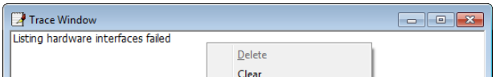

#### Driver selection
To select controller use *CAN->Driver Selection->{Driver}* For example to select your Peak-CAN USB device use ***CAN>Driver Selection->PEAK USB***.

#### Channel configuration
If there are multiple devices connected BUSMASTER will display a Hardware selection dialog as shown below
to map the devices and the channels.

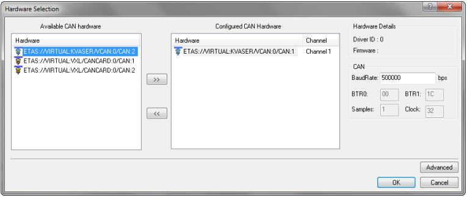

#### CAN Parameter Configuration
BUSMASTER Will select the open the CAN Channel with 500kbps by default. These default parameters can be changed using CAN channel configuration window. Click on the "Advanced" button provided in the hardware selection dialog. This will invoke the Configure CAN Controller dialog depending on the controller selected.

The following figure shows the channel configuration window.

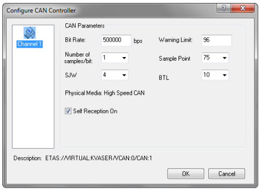

#### Connect
Once the Configuration done, BUSMASTER can be connected to the CAN Network using **CAN->Connect** menu. You should now see data starting to come in.

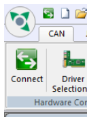

To see at which frequency each message is sent, use **CAN->Message Window->Time Mode->Relative time mode**.

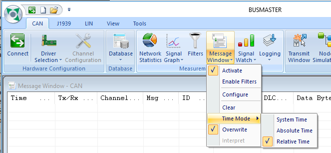

To choose the decimal or hexadecimal display format use: **View->Hex**

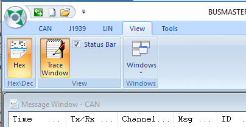


#### Database Configuration and Data interpretation
This is an optional step and is required for Message&Signal interpretation of CAN data in BUSMASTER. If you are trying to reverse engineer (RE) a CAN Bus you won't have this at first but your goal is to build such a database. See further down for more on the RE process.

**Database conversion**
If you existing CAN database is a ".dbc" file you have to convert it to a ".dbf" file to use it with BUSMASTER.

Use  **Tools->Format Converter** menu:

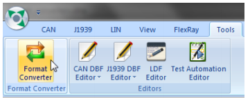

Choose the **other converters** tab:

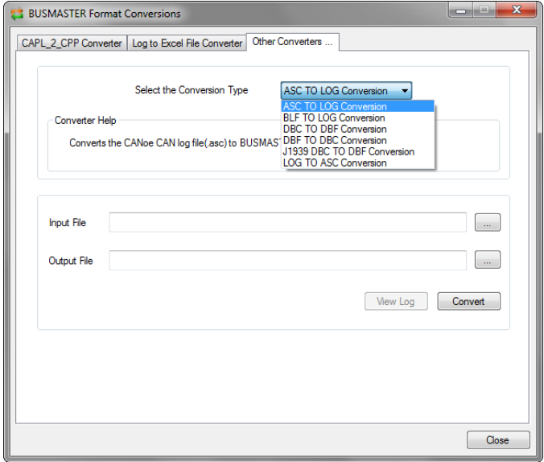

From the dropdown menu choose the **DBC to DBF Conversion**. Choose your input file, and a name for your output file, then press **Convert**.

**Database association**
To enable messages interpretation, you need to "associate the database" with the current BUSMASTER configuration. 
Use **CAN->Database->Associate**.

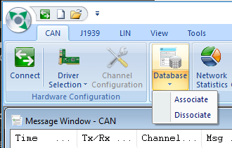

**Message Interpretation**
Use **CAN->Message Window->Interpret** to either enable or disable message on-line interpretation.

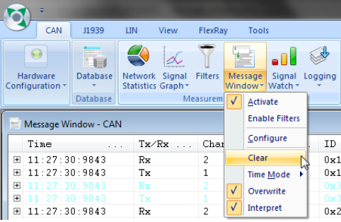

This button is enabled only in *message overwrite mode*. If on-line interpretation of message is enabled, a message
entry will be followed by a textual description of the received message.

The aforementioned will be done only if the message ID is found in the database. Else the message will be
followed by a notification message stating “message not found in the database”.

Message interpretation can be obtained by double clicking on the message or clicking the expand/collapse buttons in the message window.

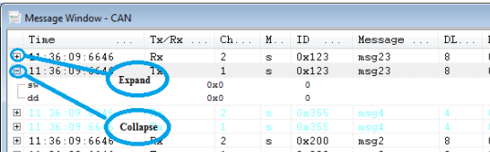

#### Sending messages on the bus
Messages can be send over CAN-bus by following the steps given below. Select **CAN --> Transmit Window** menu option. This will display the dialog as shown is figure below.

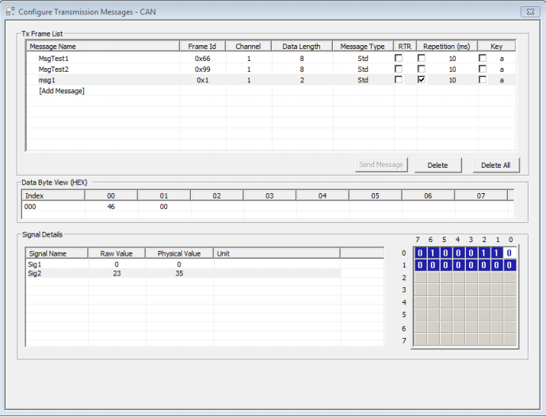

**Configuring Messages:**
Once DBF Files are imported the Messages ( DB Messages ) in DBF files will be populated in Tx Frame list column. Double Click on [Add Message] to select a database message. It is also possible to add Non-DB Messages by typing in the Message id.

* If the Message ID/Name from a database is selected then DLC and frame type will be updated with database information. The Signal List will be enabled with signals defined in the database. Signal Raw or Physical values can be directly entered in this list. After validation the data will be updated.

* Signal descriptor can be used to enter physical value. Double clicking the physical value cell of a signal that got descriptor will show a list of signal descriptors.

* If the message ID is not a database message enter DLC, Message bytes. In this case signal list will be disabled.

* RTR message can be added to by selecting RTR check box

* The Signal Matrix (at the bottom-right corner) will show the bit pattern of the data bytes.

**Cyclic Transmission of Message:**
The message can be transmitted periodically by Enabling Repetition. Cyclic Transmission will be useful to transmit the message with different data bytes periodically. Transmission will start automatically once the BUSMASTER is connected to BUS and stops on disconnect.

**Transmission on Event:**
The Messages can be sent to the network on pressing key. Each message in Tx Frame List can be assigned an alpha-numeric key.

#### More details
For more details see [BUSMASTER's user manual](https://raw.githubusercontent.com/rbei-etas/busmaster-documents/master/help.pdf). It is also possible to log and replay messages with Busmaster much like with *canutils*.

### Using Kvaser Database Editor (DBC editor)

All communication-relevant data that are processed in a networked CAN bus system as well as their interrelationships are usually administered in a central communications database.
Kvaser Database Editor is a freely distributed data administration program with which these communication databases can be created and modified in the form of CAN databases (dbc). 

#### Downloading it
Either use this [direct link](http://canlandbucket.s3-website-eu-west-1.amazonaws.com/productionResourcesFiles/12be7b14-7f85-454c-bec1-09553f797851/kvaser_database_editor_setup.exe) or go on the [Kvaser download page](https://www.kvaser.com/downloads-kvaser/) and use Ctrl-F *"database"* on the page to find the right software.

#### Creating a CAN database
* Open the program.
* File->New
* File->Save As..
* Choose the name of your *.dbc.

#### Adding messages to it
* Right click in the Messages & Signals tab.

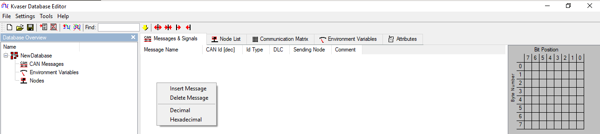

* Choose "Insert Message"

* Next you need to specify at least its **Name, CAN Id and DLC**. 

#### Adding signals to the message
* This is where the Reverse Engineering comes in! To populate the signals you need to figure out what is the meaning of the bits/bytes in the CAN frame data (also called the "payload"). For more insight on how to figure this out, see the **CAN Reverse Engineering** section below.

* Right click in the signal section.

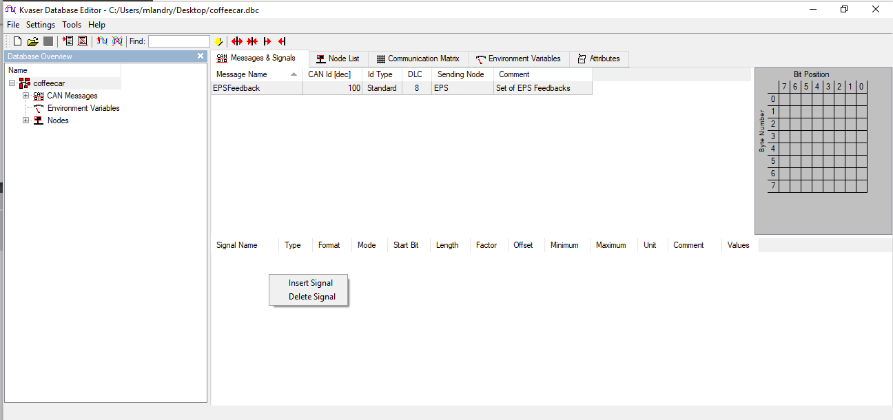

* Type in the signal characteristics:

**Signal name**
Choose a name for this signal!

**Type**
Most of the time, the type is *Unsigned* even when the interpreted data have negative values. It is common practice to use the offset value instead and leave out a bit of padding at the end of the signal range. Under the SAE J1939 standard, a 1 byte signal value of 0xFE means "Error" and 0xFF means "N/A". Therefore, the "Error" value on a 2 bytes signal would be 0xFFFE and the "N/A" would be 0xFFFF etc...

**Format**
Intel is the Little Endian byte order and Motrola is the Big Endian.

**Mode**
Almost everytime the Mode is *Normal*. The *Mode Signal* is for signal multiplexing which is not common.

**Start Bit**
Bit number at which the signal starts! Ranges from 0 to (DLC*8 -1).

**Length**
Length of the signal.

**Factor**
Factor applied to the raw value

**Offset**
Offset applied to the intermediate value

***Real World Value Computation Example:***
```sh
real_world_value = raw_value * Factor + Offset
```

**Minimum**
Optional - Minimum possible value for the signal. BUSMASTER will prevent you from using a smaller value in the transmit windows.

**Maximum**
Optional - Maximum possible value for the signal. BUSMASTER will prevent you from using a larger value in the transmit windows.

**Unit**
Describes the real world unit of measure.

**Comment**
Optional - Describe the content of the signal

**Values**
Tables where you can associate alphanumeric definitions to specific values of the signal.

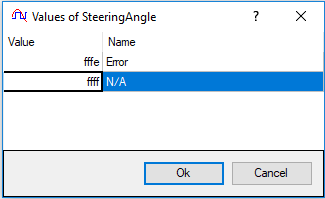

**Here's a Steering Angle signal example**

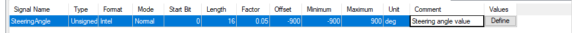

with its associated signal matrix:

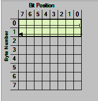

Once you have completed your dbc file, convert it in dbf (see above) and associate it in BUSMASTER to validate your understanding of the CAN signals. 

For more details see [Kvaser Database Editor's user manual](https://www.kvaser.com/software/7330130980334/V2/UG_98033_kvaser_database_editor_userguide.pdf).

## CAN Reverse Engineering

### What we want to do
Manipulate CAN enabled vehicle components.

### Problem
Manufacturer do not publish CAN message information about
specific CAN components (ECUs).

* Message IDs
* Payload information (Byte offsets)

### Solution
Manualy correlate physical system interaction with identifiable patterns in the Payload information.

#### Methodology
Several methodologies exist to facilitate the patern identification. All of it depends on the situation. Here I will propose one way to do it.

1. Create a blank dbc and populate it with all the unique CAN IDs you find by sniffing the bus.

2. Unplug each component one by one to see which messages are associated with the presence of which component.
**Warning #1** : It happens quite often that the CAN bus will enter a component on 2 pins and will come out of it on 2 other pins. In that case you will need to jump the connexions to prevent the bus from being split in 2. 
**Warning #2** : By unpluging the last component of the bus you may have removed the termination resistor at the same time. Measure the resistance between CAN-H and CAN-L with the power off to ensure it isn't the case.

3. Get the previously gathered info, assign a node name to each messsage in the DBC.

4. For each message, try to correlate a physical interaction with its associated component to a change in the message payload. For example, flip the switches, move the steering press the gas pedal, engage the auto-pilot etc.
**Hint #1** : record what you are doing with a video camera and try to synchronize the video feed with your can logging system.
**Hint #2** : High repeat rate messages (<100ms) are often associated with time critical, safety critical systems.
**Hint #3** : The last byte of these safety critical messages is often used to store a counter (bit 0..3) and a checksum (bit 4..7) of the preceding bytes + counter value. The exact byte layout and checksum computation is manufacturer specific.
5. Once the change has been identified, try to transmit the message from BUSMASTER and see the effect on the physical system.
**Hint #4** : If a counter is present in the message, only one node per bus can transmit it. You have to unplug the original node and reset the whole system while transmitting your test message to be able to test it properly.

6. Once the effect have been validated, name the signal in the DBC and try to discover everything! But most importantly :

***Hack with love!***

## Using Socket CAN with ROS 

Use the **socketcan_bridge** node! Super easy to use! [Read the doc!](http://wiki.ros.org/socketcan_bridge)
 
## DBC importing with Python

Use **cantools** library! Again, super easy to use ! [Read the doc!](https://github.com/eerimoq/cantools)

