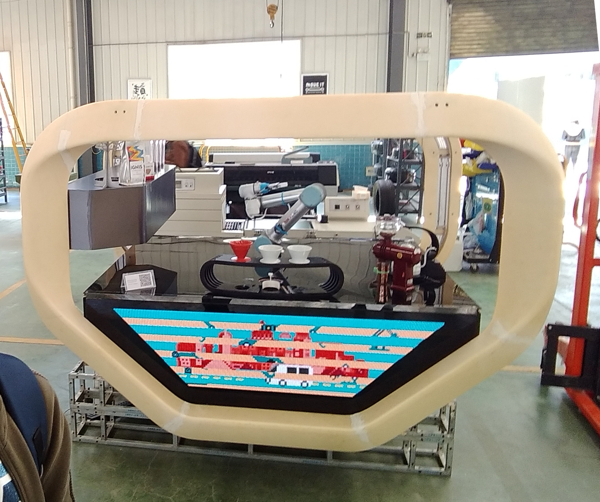
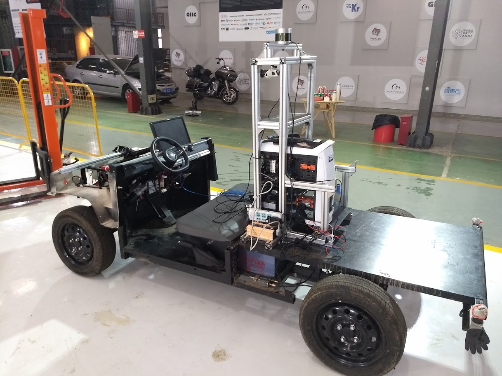

# Coffee car CAN Hack - related code & packages

---

This repository contains packages, code and documentation on how we hacked the "Coffee Car" for the [PixMoving MoveIt Hackathon](https://www.pixmoving.com/move-it). The Coffee Car is in fact a striped down and modified [Kaiyun Pickman](http://www.kaiyunmotors.com/pickman.jsp) (also rebranded as a [Lifan C3](http://www.lifanmotors.net/electricCar/C3/)) electric pickup truck.

To learn more about the CAN hacking process check out our little [HACKING guide](HACKING.md) here.

## Screenshots

## Features
* Uses an XBox controller as an input device
* Full steering control via an angle command (control algorithm inside the VCU)
* Throttle and braking control via a speed command (control algorithm inside the VCU)

## Stuff Left To Do
* Control algorithm gain scheduling to avoid steering and speed oscillations depending of speed and vehicle loading. Could have been achieved via a new VCU firmware which would have allowed to chnage the PID gains live via a CAN command.

## Try it yourself
### Hardware requirements
* [PCAN USB](https://www.peak-system.com/PCAN-USB.199.0.html?&L=2) or any other SocketCan compatible device
* PixMoving MoveIt Hackathon's Coffee Car
* Decent laptop + Xbox Controller

### Software Dependencies
 * Python 2.7
 * ROS Kinetic
 * Ubuntu 16.04
* [PCAN linux driver](http://www.peak-system.com/fileadmin/media/linux/index.htm) follow the pdf guide to build and install the driver
* [can-utils package](https://github.com/linux-can/can-utils) `sudo apt-get install can-utils`
* [Socket-can bridge](http://wiki.ros.org/socketcan_bridge) :`sudo apt-get install ros-kinetic-socketcan-bridge`
* [can_msgs](http://wiki.ros.org/can_msgs) : `sudo apt-get install ros-kinetic-can-msgs`
 * [cantools library](https://github.com/eerimoq/cantools) :`pip install cantools`

## License

MIT

